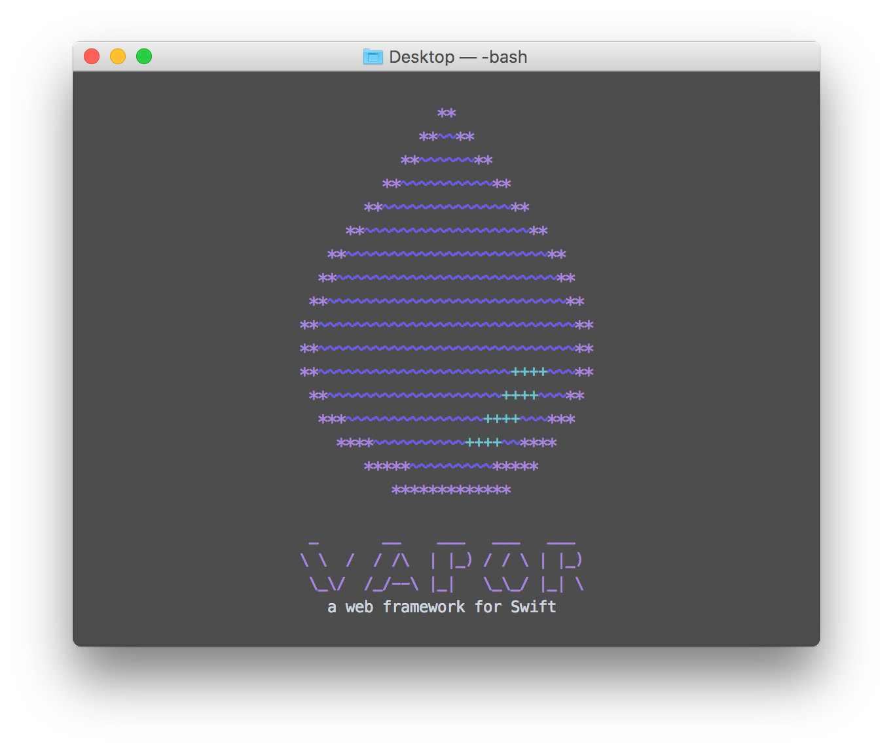

# 安装Toolbox

Vapor命令行接口提供了对常用任务的便捷支持。



```help``` 打印出了可用命令的相关信息。

```
vapor --help
```

也可以在任意toolbox命令中运行 ```--help``` 选项。

```
vapor new --help
```

```--help```参数应该成为你学习toolbox的入口，因为它总是最新的。

## 新建

Toolbox最重要的功能是帮助你创建一个新项目。

```
vapor new <name>
```

只需要填写你的项目名字作为```new```命令的第一个参数即可。

> 注意：项目名字应该是 [PascalCase →](http://wiki.c2.com/?PascalCase) ，比如 ```HelloWorld``` 或者 ```MyProject``` 。

## 模版

默认情况下，Vapor将以API作为模版创建新项目。不过你也可以通过传递 ```--template``` 参数来选择不同的模版。

Name | Flag | Description
----|----|----
API | ```--template=api``` | JSON API with Fluent database.
Web | ```--template=web``` | HTML website with Leaf templates.

> 提示：GitHub [vapor + template topcs →](https://github.com/search?utf8=%E2%9C%93&q=topic%3Avapor+topic%3Atemplate&type=Repositories) 上有很多非官方的Vapor模版。你可以通过传递完整的GitHub URL作为```--template```参数来使用。

## 编译 & 运行

你可以使用toolbox来编译并运行Vapor应用。

```
vapor build
vapor run
```

> 提示：
> 
> 如果你有Mac的话，我们推荐使用 [Xcode](../getting_started/xcode.md) 来执行编译运行操作。使用Xcode更便捷，你也可以设置断点！同时，只需要使用 ```vapor xcode``` 来生成Xcode项目。

## 更新

通过包管理器来更新toolbox版本。

### Homebrew

```
brew upgrade vapor
```

### APT

```
sudo apt-get update
sudo apt-get install vapor
```